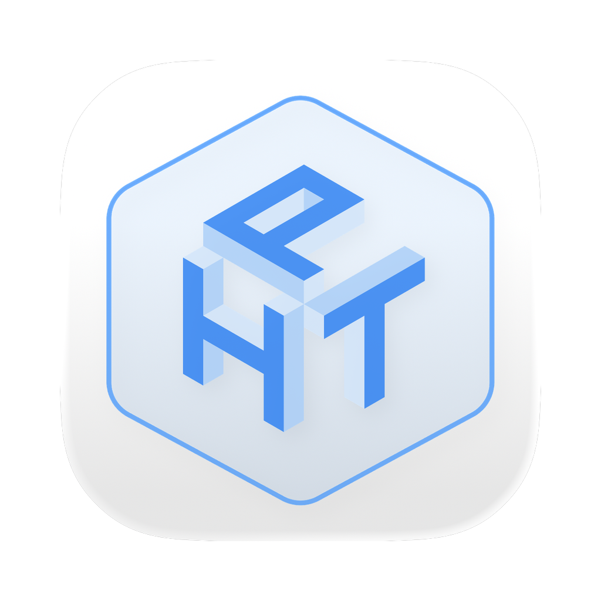

  

<h1 align="center">📋 Daftar Fitur HyperTopia Installer</h1>

  <strong>Dokumentasi lengkap fitur-fitur yang tersedia di aplikasi HyperTopia Installer</strong>

---

## 📖 Daftar Isi

- [Instalasi Game VR](#-instalasi-game-vr)
- [Manajemen Perangkat](#-manajemen-perangkat)
- [Apps Manager](#-apps-manager)
- [OBB Manager](#-obb-manager)
- [Quest Games Optimizer (QGO)](#-quest-games-optimizer-qgo)
- [Standalone Games Library](#-standalone-games-library)
- [Download Manager](#-download-manager)
- [Live Assist](#-live-assist)
- [Tutorial Interaktif](#-tutorial-interaktif)
- [Sistem Akun & Profil](#-sistem-akun--profil)
- [Redeem Code](#-redeem-code)
- [Pengaturan & Kustomisasi](#️-pengaturan--kustomisasi)
- [Auto-Update](#-auto-update)
- [Deep Link Support](#-deep-link-support)
- [UI/UX Modern](#-uiux-modern)
- [Tech Stack](#️-tech-stack)

---

## 📦 Instalasi Game VR

### Fitur Utama:

- **Drag & Drop** — Cukup seret file ZIP/RAR yang berisi game ke dalam aplikasi
- **Auto-Detection** — Otomatis mendeteksi file APK dan OBB di dalam arsip
- **Format Support** — Mendukung format `ZIP`, `RAR` (termasuk RAR5), dan `7z`
- **One-Click Install** — Instalasi dengan satu klik:
  - Install APK saja
  - Install APK + OBB (Full Bundle)
- **Progress Tracking** — Tracking progress real-time untuk:
  - Ekstraksi arsip
  - Push APK ke perangkat
  - Push OBB ke perangkat
- **Cancel Installation** — Dapat membatalkan instalasi kapanpun selama proses berlangsung
- **Browse Methods**:
  - Pilih file arsip (ZIP/RAR/7z)
  - Pilih folder yang sudah diekstrak

### Cara Kerja:

1. Hubungkan Quest ke PC via USB
2. Seret file game (ZIP/RAR) ke area drop zone
3. Aplikasi akan scan isi arsip
4. Pilih "Install APK" atau "Install Full"
5. Tunggu proses selesai ✨

---

## 🔌 Manajemen Perangkat

### Fitur Utama:

- **Auto Device Detection** — Deteksi otomatis perangkat Quest yang terhubung via ADB
- **Multiple Device Support** — Dukungan untuk beberapa perangkat sekaligus
- **Device Selector** — Pilih perangkat target untuk instalasi
- **Connection Status** — Status koneksi yang jelas (Connected/Disconnected)
- **Device Info** — Menampilkan informasi:
  - Serial Number
  - Model perangkat (Quest 1, 2, 3, Pro)
- **Device Preference** — Simpan preferensi perangkat untuk download game

### Perangkat yang Didukung:

- Meta Quest 1
- Meta Quest 2
- Meta Quest 3
- Meta Quest Pro

---

## 📱 Apps Manager

### Fitur Utama:

- **List Installed Apps** — Lihat semua aplikasi sideload di perangkat Quest
- **App Details** — Tampilkan informasi:
  - Nama aplikasi (auto-parse dari package name)
  - Package name
  - Versi aplikasi
- **Uninstall Apps** — Hapus aplikasi yang tidak diinginkan langsung dari installer
- **Search & Filter** — Cari aplikasi berdasarkan nama
- **Refresh** — Perbarui daftar aplikasi

---

## 📂 OBB Manager

### Fitur Utama:

- **Browse OBB Folders** — Lihat semua folder OBB di `/sdcard/Android/obb/`
- **Storage Overview** — Lihat game mana yang menggunakan storage
- **Search Function** — Cari folder OBB berdasarkan nama package
- **Real-time Scanning** — Scan folder OBB secara real-time

---

## 🎮 Quest Games Optimizer (QGO)

### Deskripsi:

Quest Games Optimizer adalah tools untuk mengoptimalkan game di Quest, yang di-maintain oleh developer terpisah dan didistribusikan via HyperTopia Installer.

### Fitur Utama:

- **Version List** — Lihat semua versi QGO yang tersedia dari API
- **Download QGO** — Download file APK langsung dari Google Drive
- **Progress Tracking** — Progress download dengan:
  - Kecepatan download (MB/s)
  - ETA (estimasi waktu selesai)
  - Persentase progress
- **Local File Management**:
  - Cek file yang sudah didownload
  - Install dari file lokal
  - Hapus file yang tidak dibutuhkan
- **Version Check** — Cek versi yang terinstall di perangkat
- **One-Click Install** — Install langsung setelah download selesai
- **Minimize to Widget** — Minimize modal download ke widget di pojok kanan bawah
- **Uninstall** — Hapus QGO dari perangkat

---

## 📚 Standalone Games Library

### Deskripsi:

Akses library game VR standalone langsung dari aplikasi, terintegrasi dengan HyperTopia API.

### Fitur Utama:

- **Game Catalog** — Browse katalog game VR dari HyperTopia
- **Game Details** — Lihat detail game:
  - Nama game
  - Versi tersedia (multi-version support)
  - Ukuran file
  - Jumlah download
  - Device compatibility
  - Cover image
- **Multi-Version Support** — Pilih versi game yang ingin didownload
- **Multi-Part Download** — Support game dengan multiple download parts
- **In-App Download** — Download langsung dalam aplikasi (Google Drive & Dropbox)
- **Download Progress Widget** — Widget progress download di pojok kanan bawah
- **Download & Install** — Download lalu langsung install ke perangkat
- **Device Compatibility Check** — Cek kompatibilitas game dengan perangkat
- **Search & Sort** — Cari dan urutkan game
- **Pagination** — Navigasi halaman dengan opsi items per page
- **File Management**:
  - Lihat file yang sudah didownload
  - Hapus file individual atau semua parts

---

## ⬇️ Download Manager

### Fitur Utama:

- **Background Download** — Download berjalan di background
- **Download Widget** — Widget minimalis di pojok kanan bawah menampilkan:
  - Nama file
  - Progress (%)
  - Kecepatan download
  - ETA
- **Cancel Download** — Batalkan download kapanpun
- **Resume Support** — Lanjutkan download yang terputus
- **Multi-Source Support**:
  - Google Drive (direct download)
  - Dropbox (direct download)
- **Auto File Size Update** — Update ukuran file ke API setelah download selesai

---

## 🎧 Live Assist

### Deskripsi:

Fitur bantuan live dengan admin HyperTopia menggunakan WebRTC untuk audio dan screen sharing.

### Fitur Utama:

- **Request Assistance** — Minta bantuan dari admin
- **Audio Call** — Panggilan suara real-time dengan admin
- **Screen Sharing** — Share layar ke admin untuk troubleshooting
- **Session Queue** — Antrian sesi untuk menunggu admin available
- **Session Timer** — Timer durasi sesi
- **Mute Toggle** — Matikan/nyalakan mic
- **End Session** — Akhiri sesi kapanpun

### Untuk Admin:

- **View Queue** — Lihat antrian user yang membutuhkan bantuan
- **Join Session** — Bergabung dengan sesi user
- **View Screen Share** — Lihat screen share dari user
- **Audio Communication** — Komunikasi audio dua arah

---

## 📖 Tutorial Interaktif

### Fitur Utama:

- **Step-by-Step Guides** — Panduan langkah demi langkah
- **Visual Instructions** — Petunjuk visual dengan gambar
- **Multiple Topics** — Berbagai topik tutorial:
  - Cara mengaktifkan Developer Mode
  - Cara menghubungkan Quest ke PC
  - Cara install game
  - Dan lainnya

---

## 👤 Sistem Akun & Profil

### Fitur Utama:

- **Google Sign-In** — Login dengan akun Google via:
  - Deep link ke website HyperTopia
  - Popup browser window (fallback)
- **User Profile** — Lihat profil user:
  - Nama
  - Email
  - Foto profil
  - Tipe akses (Premium/Basic)
  - Tanggal register
  - Tanggal expired (jika premium)
- **Session Management** — Logout dari akun

---

## 🎁 Redeem Code

### Fitur Utama:

- **Code Redemption** — Tukarkan kode promo/voucher
- **Code Search** — Cari dan validasi kode sebelum redeem
- **Code Details** — Lihat detail kode:
  - Nama produk
  - Durasi akses
  - Status (active/used/expired)
- **Redeem Confirmation** — Konfirmasi sebelum redeem

---

## ⚙️ Pengaturan & Kustomisasi

### Fitur Utama:

- **Extraction Path** — Pilih lokasi folder ekstraksi temporary
- **Storage Info** — Lihat informasi disk:
  - Total space
  - Used space
  - Free space
  - Visual indicator (progress bar dengan warna)
- **Language Selection** — Pilihan bahasa:
  - 🇺🇸 English
  - 🇮🇩 Bahasa Indonesia
- **Changelog** — Lihat perubahan di setiap versi
- **Auto-Update Toggle** — Aktifkan/nonaktifkan auto-update

---

## 🔄 Auto-Update

### Fitur Utama:

- **Automatic Check** — Cek update otomatis saat aplikasi dibuka
- **Update Notification** — Notifikasi saat update tersedia
- **Update Modal** — Modal detail update dengan:
  - Versi baru
  - Changelog
  - Ukuran download
  - Progress download
  - Kecepatan download
  - ETA
- **Download & Install** — Download update dan install otomatis
- **Manual Check** — Cek update manual dari Settings

---

## 🔗 Deep Link Support

### Deskripsi:

Dukungan deep link `hypertopia://` untuk integrasi dengan website HyperTopia.

### Use Cases:

- **Auth Callback** — Callback dari website setelah login Google
- **Direct Game Install** — Buka game tertentu langsung dari website

---

## 🎨 UI/UX Modern

### Fitur Utama:

- **Dark Theme** — Tema gelap yang nyaman di mata
- **Smooth Animations** — Animasi halus dengan Framer Motion
- **Responsive Design** — Adapt ke berbagai ukuran window
- **Modern Sidebar** — Sidebar collapsible dengan navigasi
- **Toast Notifications** — Notifikasi toast untuk feedback
- **Loading States** — Loading state yang informatif
- **Error Handling** — Error modal dengan pesan yang jelas
- **Network Status** — Indikator status jaringan dengan latency

---

## 🛠️ Tech Stack

| Technology                                          | Purpose                                        |
| --------------------------------------------------- | ---------------------------------------------- |
| **[Electron](https://www.electronjs.org/)**         | Framework desktop cross-platform               |
| **[React](https://react.dev/)**                     | Library UI                                     |
| **[Vite](https://vitejs.dev/)**                     | Build tool                                     |
| **[Tailwind CSS](https://tailwindcss.com/)**        | Utility-first CSS                              |
| **[Framer Motion](https://www.framer.com/motion/)** | Library animasi                                |
| **[ADB](https://developer.android.com/tools/adb)**  | Android Debug Bridge (komunikasi dengan Quest) |
| **[7-Zip](https://www.7-zip.org/)**                 | Handling file ZIP dan 7z                       |
| **[UnRAR](https://www.rarlab.com/)**                | Handling file RAR                              |
| **[Firebase](https://firebase.google.com/)**        | Authentication & Database                      |
| **[WebRTC](https://webrtc.org/)**                   | Live Assist (audio & screen share)             |

---

## 📊 Statistik Proyek

| Metric                      | Value                     |
| --------------------------- | ------------------------- |
| **Versi Terkini**           | v1.0.197                  |
| **Platform**                | Windows, macOS, Linux     |
| **Bahasa**                  | English, Bahasa Indonesia |
| **Total Components**        | 29 komponen React         |
| **Total Context Providers** | 7 context                 |
| **Main Process Size**       | ~107KB (3245 lines)       |

---

**Dokumentasi ini dibuat berdasarkan analisis source code HyperTopia Installer**

_Last Updated: 22 Januari 2026_

