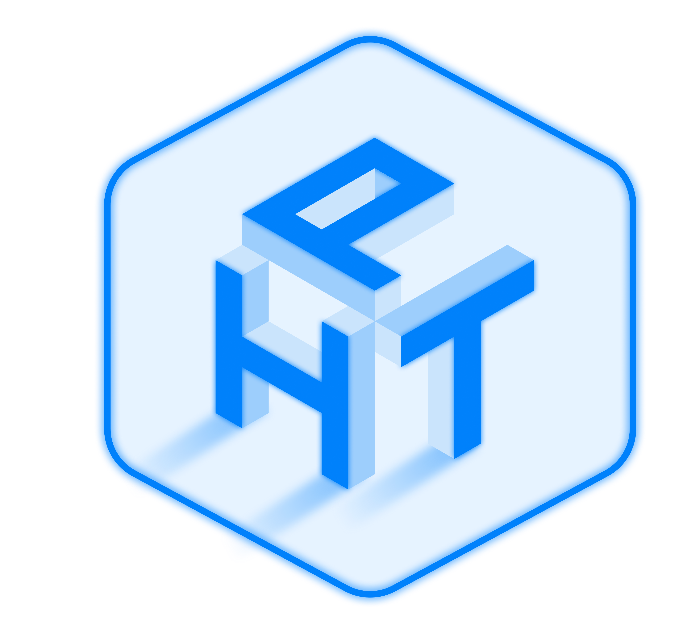

<p align="center">
  
</p>

<h1 align="center">HyperTopia Installer</h1>

<p align="center">
  <strong>Advanced VR Sideloading Tool for Meta Quest</strong>
</p>

<p align="center">
  <a href="https://github.com/rigelra15/hypertopia-installer-desktop/actions">
    
  </a>
  <a href="https://github.com/rigelra15/hypertopia-installer-desktop/releases/latest">
    
  </a>
  
</p>

---

## ✨ What is HyperTopia Installer?

**HyperTopia Installer** is a modern, cross-platform desktop application designed to make sideloading VR games and apps to your **Meta Quest** headset as easy as possible. Simply drag and drop your game files (ZIP/RAR containing APK + OBB), and let the installer handle the rest!

No complicated command-line tools, no confusing setup — just a beautiful, intuitive interface that works on Windows, macOS, and Linux.

---

## 🚀 Features

### 📦 Easy Game Installation

- **Drag & Drop** — Simply drag your ZIP/RAR file containing the game
- **Auto-Detection** — Automatically detects APK and OBB files inside archives
- **One-Click Install** — Install APK only or full bundle (APK + OBB) with a single click
- **Progress Tracking** — Real-time progress bar for extraction and installation

### 🔌 Device Management

- **Auto Device Detection** — Automatically detects connected Quest devices via ADB
- **Multiple Device Support** — Switch between multiple connected devices
- **Connection Status** — Clear indicators showing device connection state

### 📱 Apps Manager

- **View Installed Apps** — See all sideloaded apps on your Quest
- **Uninstall Apps** — Remove unwanted apps directly from the installer
- **App Details** — View package names and version info

### 📂 OBB Manager

- **Browse OBB Files** — View OBB folders on your device
- **Manage Storage** — See which games are using storage space

### 🌐 HyperTopia Store Integration

- **Browse Games** — Access the HyperTopia game library directly
- **One-Click Downloads** — Seamless integration with the web store

### 📚 Built-in Tutorials

- **Step-by-Step Guides** — Learn how to install games properly
- **Visual Instructions** — Easy-to-follow tutorials with images

### ⚙️ Settings & Customization

- **Custom Extract Path** — Choose where to extract temporary files
- **Storage Info** — View available disk space
- **Multi-Language** — Available in English and Indonesian (Bahasa Indonesia)

### 🎨 Modern UI/UX

- **Dark Theme** — Beautiful dark interface that's easy on the eyes
- **Smooth Animations** — Polished transitions powered by Framer Motion
- **Responsive Design** — Adapts to different window sizes

---

## 📥 Download

Download the latest version for your operating system:

| Platform    | Download                                                                                                                                                                                             |
| ----------- | ---------------------------------------------------------------------------------------------------------------------------------------------------------------------------------------------------- |
| **Windows** | [hypertopia-installer-x.x.x-setup.exe](https://github.com/rigelra15/hypertopia-installer-desktop/releases/latest)                                                                                    |
| **macOS**   | [hypertopia-installer-x.x.x.dmg](https://github.com/rigelra15/hypertopia-installer-desktop/releases/latest)                                                                                          |
| **Linux**   | [hypertopia-installer-x.x.x.AppImage](https://github.com/rigelra15/hypertopia-installer-desktop/releases/latest) / [.deb](https://github.com/rigelra15/hypertopia-installer-desktop/releases/latest) |

---

## 🛠️ Requirements

- **Meta Quest** headset (Quest 1, Quest 2, Quest 3, Quest Pro)
- **USB Cable** for connecting your Quest to your computer
- **Developer Mode** enabled on your Quest ([How to enable](https://developer.oculus.com/documentation/native/android/mobile-device-setup/))

---

## 🚀 Quick Start

1. **Download** the installer for your OS from the [Releases](https://github.com/rigelra15/hypertopia-installer-desktop/releases/latest) page
2. **Install** the application on your computer
3. **Connect** your Quest headset via USB
4. **Enable** USB debugging when prompted on your headset
5. **Drag & Drop** your game file (ZIP/RAR) into the installer
6. **Click Install** and wait for the magic! ✨

---

## 💻 Development

### Prerequisites

- [Node.js](https://nodejs.org/) v20 or higher
- npm (comes with Node.js)

### Setup

```bash
# Clone the repository
git clone https://github.com/rigelra15/hypertopia-installer-desktop.git
cd hypertopia-installer-desktop

# Install dependencies
npm install

# Run in development mode
npm run dev
```

### Build

```bash
# Build for Windows
npm run build:win

# Build for macOS
npm run build:mac

# Build for Linux
npm run build:linux
```

### Release

```bash
# Create a new release (auto-version, tag, and push)
npm run release
```

---

## 🛠️ Tech Stack

- **[Electron](https://www.electronjs.org/)** — Cross-platform desktop framework
- **[React](https://react.dev/)** — UI library
- **[Vite](https://vitejs.dev/)** — Fast build tool
- **[Tailwind CSS](https://tailwindcss.com/)** — Utility-first CSS
- **[Framer Motion](https://www.framer.com/motion/)** — Animation library
- **[ADB](https://developer.android.com/studio/command-line/adb)** — Android Debug Bridge for device communication

---

## 📝 License

This project is for helping people to install VR games to their Meta Quest headset. Please support the developers by purchasing games you enjoy.

---

<div align="center">

**Made with ❤️ by HyperTopia Team**

</div>
